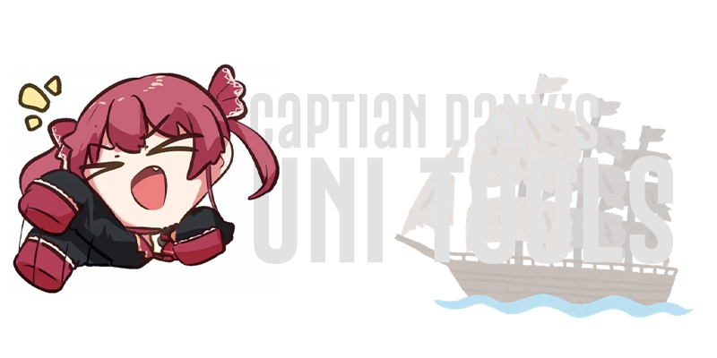

<h1  align="center">Captain Dany's Uni Tools</h1>

Be welcome! This project aims to add some online tools that can be used at school by students, teachers and other members of our uni.

## 🚀 Getting Started

These instructions will get you up and running with this amazing project in no time!

### Prerequisites

- Coffee ☕️

- Code editor of your choice 🖥️

  

### Installation

  

1. Clone this repository.

  

git clone https://github.com/your-username/awesome-project.git

  

2. Grab a cup of coffee and contemplate the awesomeness of this project.

  

3. Start coding and have fun! 💻

  

## 🎨 Features

  

- Excel to email: The only feature by now is the list converter. It takes MS Excel vertical lists and converts them into usable email recipient lists for Gmail.

  

## 🤝 Contributing

  

Contributions are welcome! If you have an amazing idea to make this project even more awesome, follow these steps:

  

1. Fork the project.

2. Create your feature branch:

  

git checkout -b my-awesome-feature

  

3. Commit your changes:

  

git commit -am 'Added an awesome feature'

  

4. Push to the branch:

  

git push origin my-awesome-feature

  

5. Open a pull request and let's make magic happen! 🌟✨

  

## 📃 License

  

This project is licensed under the MIT License - see the [LICENSE](LICENSE) file for details.

  

## 🙌 Acknowledgments

  

Special thanks to:

  

- Vanilla Cream Cold Brew for keeping me awake and focused. ☕

- The school hommies for inspiring the project.

- You, for checking out this awesome project! 🎉

  

Now, let's go and build something incredible together! Fly the flag! 😄🏴‍☠️